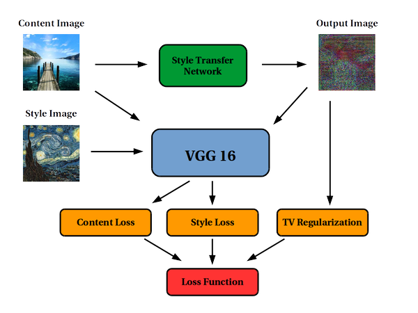
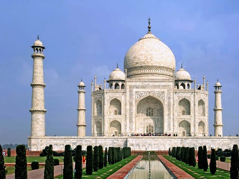
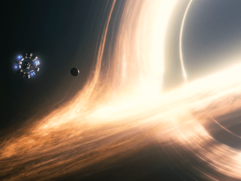
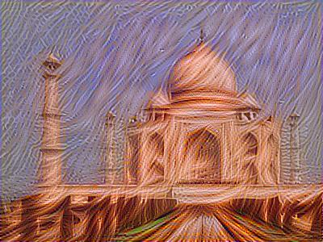
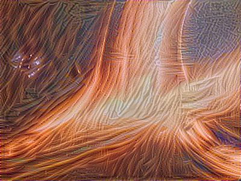

# Neural Style Transfer

**Prerequisites**
1. Convolutional Neural Networks :

- This project requires slightly different approach with the Networks.
- As there is no need for classification in this problem statement.

2. VGG Net : 
- Following the original NST paper, we will use the VGG network.
- Specifically, we'll use VGG-19, a 19-layer version of the VGG network.
- This model has already been trained on the very large ImageNet database, and thus has learned to recognize a variety of low level features (at the shallower layers) and high level features (at the deeper layers).

3. Tensorflow :

4. Cost Function :
  
  - Content Cost Function
  - Style Cost Function.
  
5. Transfer Learning :

### What is Neural Style Transfer : 

Neural Style Transfer refers to a class of software algorithms that manipulate digital images,
or videos, to adopt the appearance or visual style of another image. 
NST algorithms are characterized by their use of deep neural networks in order to perform the image transformation.

- For Example:

### Final Architecture of the Network :

### Concept : 

- Using the Methodology of Transfer Learning, in this project we'll combine Content Images with Style images to change the Neural style 
of the images.

- First the image is processed directly and a new image is generated.

- Most of the time the generated image is Noisy with a high Cost function.

- Further using Hyperparameter Tuning and Optimization this cost function is reduced to **obtain new Artistic changed image.**

Look for Example:

**TAJ-MAHAL**

**Gargantua (From Interstellar)**

Became This:

- This Project uses pretrained VGG Network for training and combining with our model to generate these images.

- To understand this project fully Knowledge of Cost function is advised.

***********************************************************************************
**All the images are picked from Google images only and the project is for 
Education purpose only and not for production** 
