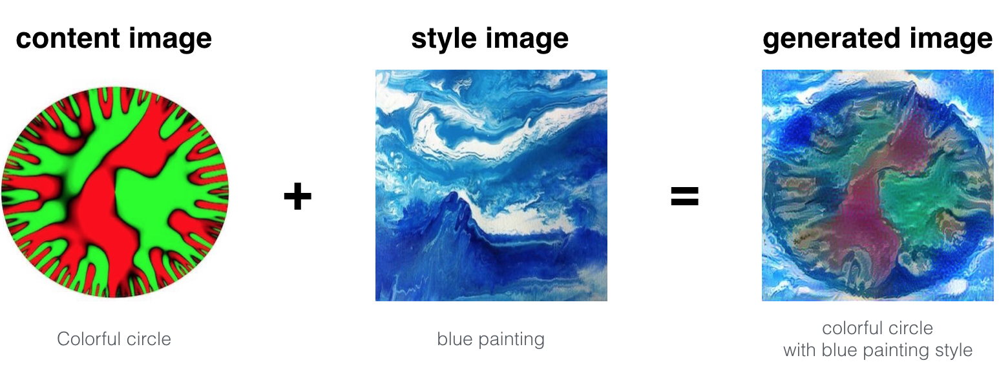

# Neural Style Transfer

**Prerequisites**
1. Convolutional Neural Networks :

2. VGG Net :

3. Tensorflow :

4. Cost Function :
  
  - Content Cost Function
  - Style Cost Function.

### What is Neural Style Transfer : 

Neural Style Transfer refers to a class of software algorithms that manipulate digital images,
or videos, to adopt the appearance or visual style of another image. 
NST algorithms are characterized by their use of deep neural networks in order to perform the image transformation.

- For Example:

