This page consists most of my personal Machine learning and Artificial Intelligence projects till now. please note it includes my some kaggle notebooks as well.
List of projects. In order to visit the source code **just click on the title** and you'll be redirected to the code.
Hope you like it.

## 1. [Facial Recognition Project](https://github.com/adityakalra581/Facial_Recognition-Project):

- I have used facial Recognition package which is compatible with DLIB library.
- Few of the outputs have been shown below.

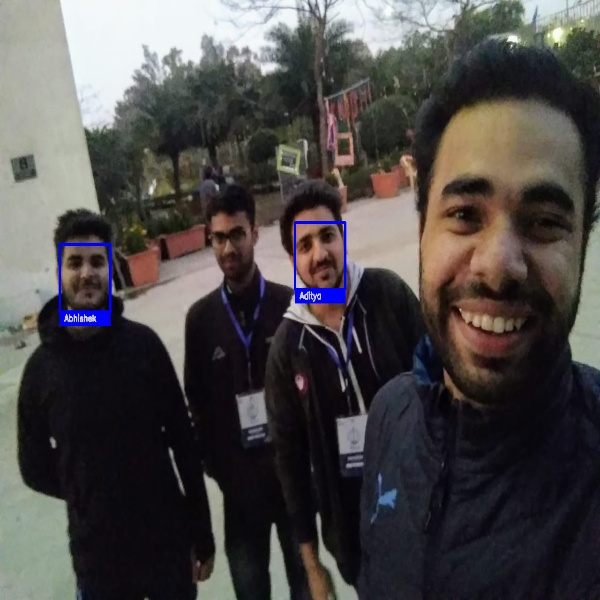

## 2. [Art Generation with Neural Style Transfer](https://github.com/adityakalra581/Data-Science/tree/master/Deep%20Learning/Convolutional-Neural-Networks/Neural-Style-Transfer):

- Neural Style Transfer refers to a class of software algorithms that manipulate digital images, or videos, in order to adopt the appearance or visual style of another image. NST algorithms are characterized by their use of deep neural networks for the sake of image transformation. 

Source: [Wikipedia](https://en.wikipedia.org/wiki/Neural_Style_Transfer)

- Sample Outputs: 

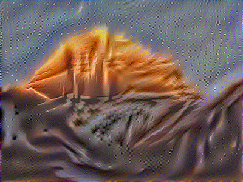

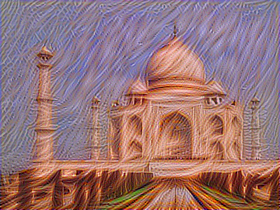

## 3. [Classical Indian Dance Multi-class Classification](https://www.kaggle.com/aditya48/indian-dance-classification):

**Problem Statement:**  Build an image tagging Deep Learning model that can help the company classify these images into eight categories of Indian classical dance.
The dataset consists of 364 images belonging to 8 categories, namely manipuri, bharatanatyam, odissi, kathakali, kathak, sattriya, kuchipudi, and mohiniyattam.

- The 8 Categories looked something like this.

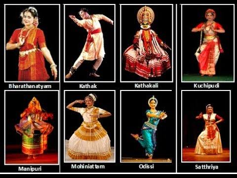

- Performance Evaluation using VGG19 on Training and Validation Data

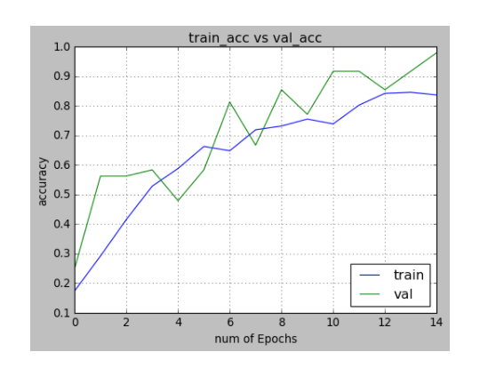

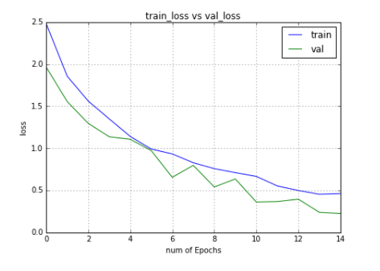

## 4. [Fraud Detection](https://www.kaggle.com/aditya48/fraud-detection-feature-eng-lightgbm/):

**Problem Statement:** The challenge is to build an algorithm that predicts whether a **user will download an app after clicking a mobile app ad**. To support your modeling, they have provided a generous dataset covering approximately 200 million clicks over 4 days!

- Some images from the notebook:

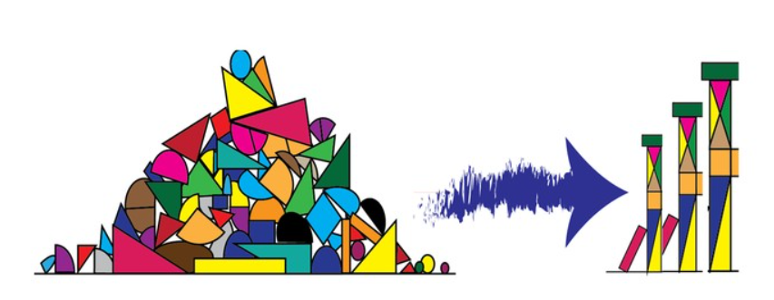

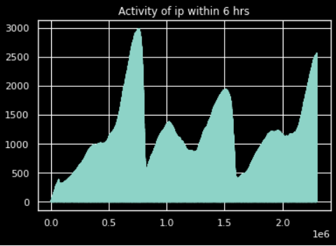

## 5. [Melanoma Classification](https://www.kaggle.com/aditya48/melanoma-classification-starter):

**Problem Statement:** In this competition, you’ll identify melanoma in images of skin lesions. In particular, you’ll use images within the same patient and determine which are likely to represent a melanoma. Using patient-level contextual information may help the development of image analysis tools, which could better support clinical dermatologists.

**What is Melanoma:** Melanoma is the deadliest form of skin cancer. It occurs when pigment-making cells in the skin, called melanocytes, begin to reproduce uncontrollably. Melanoma can form from an existing mole or develop on unblemished skin.

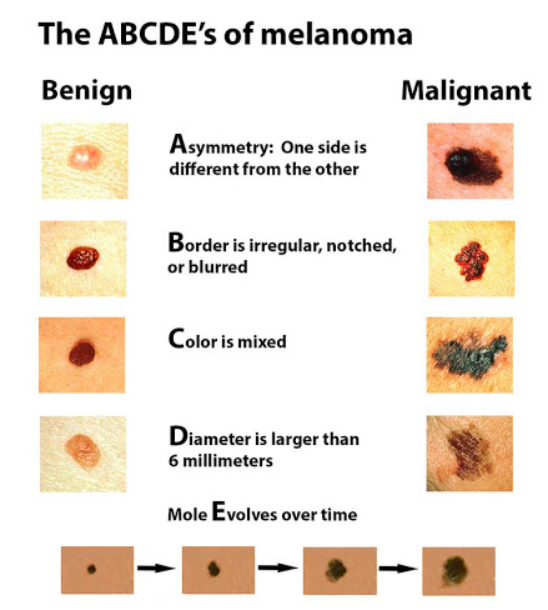

**Missing Values in Demographic Data**

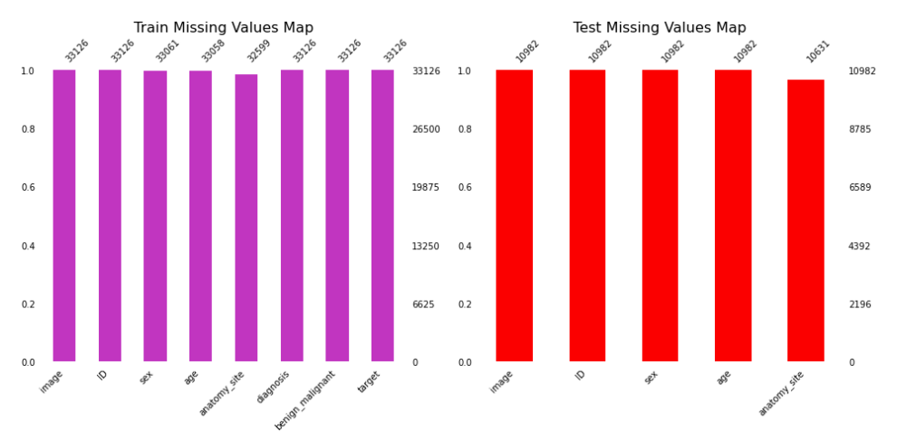

**Age and Sex Distribution of Data**

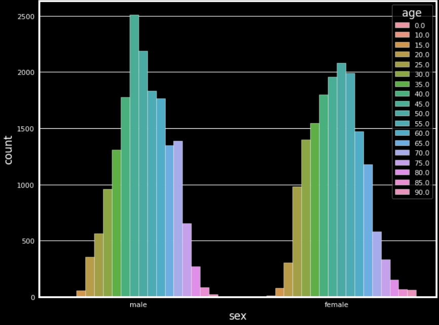

## Other projects:

### 6. [Real and Fake Facial Detection](https://www.kaggle.com/aditya48/real-and-fake-face-detection):

### 7. [Radio Signal Classification using SETI Data](https://www.kaggle.com/aditya48/radio-signal-classification-using-seti-data):

### 8. [Churn Prediction Model](https://github.com/adityakalra581/Data-Science/tree/master/Machine%20Learning/Supervised-Learning/Classification):

********************************************************************

