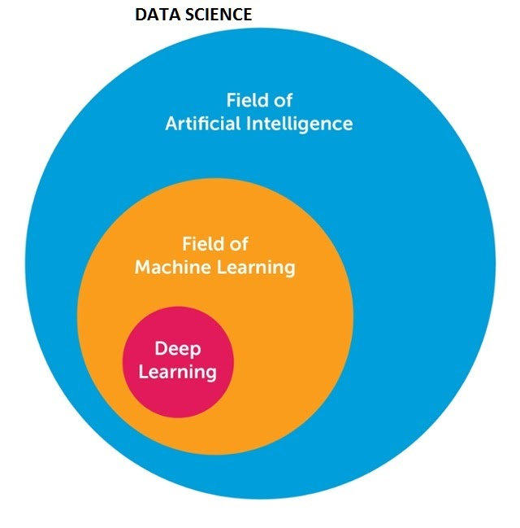

# Data-Science

Data science is an inter-disciplinary field that uses scientific methods, processes, algorithms and systems to extract knowledge and insights from many structural and unstructured data. Data science is related to data mining and big data.

source : [mygreatlearning.com](https://www.mygreatlearning.com/blog/difference-data-science-machine-learning-ai/)

This Repository includes various Data Science Concepts.

This Repository Contains:
- Machine Learning
- Deep Learning
- Data Visualization
- EDA

and few others.

All these Directories contains specific projects and tasks i have done till now.

